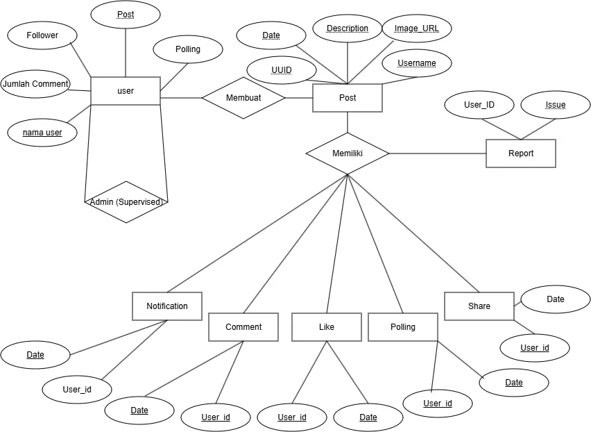

<div align="center">

 

  # [KitaKomplain]

  ### [Kesal? Komplain dulu aja kiteee!!]

 

  [](https://[URL_DEMO])

  []

  [](LICENSE)

 

  **Submission for ITECHNO CUP 2026 - Web Development**

 

  **By [KitaKomplain]**

 

</div>

---

## 📋 Daftar Isi

- [Tentang Proyek](#-tentang-proyek)

- [Fitur Unggulan](#-fitur-unggulan)

- [Demo & Screenshot](#-demo--screenshot)

- [Teknologi](#-teknologi)

- [Arsitektur Sistem](#-arsitektur-sistem)

- [Instalasi & Setup](#-instalasi--setup)

- [Penggunaan](#-penggunaan)

- [API Documentation](#-api-documentation)

- [Testing](#-testing)

- [Tim Developer](#-tim-pengembang)

- [Lisensi](#-lisensi)

---

## 👥 Tim Developer

| Nama  | Peran     | GitHub  |

| **[Carmelo Anthony]** | Project Lead & Full Stack Developer | [GitHub](https://github.com/[retry30]) |

| **[Marvel Valenxius Gunawan]** | Full Stack Developer | [GitHub](https://github.com/[marvelvg]) |

| **[Kentdji Orlando]** | Full Stack Developer | [GitHub](https://github.com/[Gordnum]) |

---

## 🎯 Tentang Proyek

### Latar Belakang

[ Indonesia saat ini masih memiliki salah satu tantangan terbesar yakni pemerataan Infrastruktur dan transparansi alokasi dana pembangunan. Berdasarkan Jurnal Ilmu Administrasi Negara (2022) menyoroti bahwa salah satu "lubang terbesar dalam demokrasi infrastruktur kita adalah minimnya transparansi pengelolaan dana daerah dan kurangnya wadah bagi masyarakat untuk melacak keluhan mereka secara terbuka" ]

### Solusi yang Ditawarkan

[ KitaKomplain di sini menjadi sebuah program yang menjembatani aspirasi masyarakat dan pemerintah, melalui melalui sebuah mekanisme sosial media yang familiar, namun diarahkan secara spesifik untuk pelaporan dan advokasi infrastruktur 
Alurnya sederhana:

Alurnya sederhana:

1. Warga membuat sebuah postingan komplain mengenai infrastruktur, jalan, atau fasilitas publik yang rusak/tidak memadai di daerahnya, lengkap dengan fitur polling/vote.
2. Semakin banyak dukungan (vote) yang diterima sebuah postingan, semakin besar indikasi bahwa masalah tersebut memang dirasakan dan disetujui oleh banyak warga sebagai isu prioritas bukan sekadar keluhan individu.
3. Postingan dengan dukungan tinggi mendapat exposure lebih besar di platform, sehingga isu-isu di daerah tertinggal secara infrastruktur bisa lebih mudah terlihat dan didorong untuk ditindaklanjuti.

]

### Tujuan Proyek

- 🎯 **Tujuan Utama**: [ Menjembatani user untuk menyampaikan aspirasinya/Keluh kesah mengenai infrastruktur/lingkungan/fasilitas umum dari pemerintah yang dimana selaras dengan SDG 7 (Affordable and Clean Energy), SDG 8 (Decent Work and Economic Growth), SDG 9 (Industry, Innovation, and Infrastructure
) dan SDG 11 (Sustainable Cities And Communities) ]

- 📊 **Target Pengguna**: [ Masyarakat dengan penuh keluh kesah ]

- 💡 **Value Proposition**: [ Belum ada aplikasi yang benar-benar menawarkan aspirasi masyarakat secara transparan & fitur autentikasinya credential yang sulit di palsukan]

---

## ✨ Fitur Unggulan

### Fitur Utama

| Fitur    | Deskripsi    | Keunggulan    | 
|----------|--------------|---------------|

| **[ Post Komplain ]** | [User dapat mengunggah sebuah komplenan berupa keluhan lingkungan sekitar maupun insiden] [Fitur ini penting karena keluhan yang di unggah akan di berikan kepada pihak pemerintah untuk di tindak lebih lanjut] |

| **[ Feed & Interaksi Sosial (Comment) ]** | [Fitur ini berfungsi agar sesama pengguna dapat berinteraksi maupun berbagi pandangan mengenai unggahan yang tertera] | [ Membangun sense of community antar user mengenai masalah-masalah yang terdapat di Indonesia ] |

| **[ Polling/Vote System ]** | [Fitur ini memungkinkan pengguna memberikan dukungan atau penolakan terhadap suatu komplain berdasarkan tingkat urgensi dan relevansi masalah yang diangkat.] | [Membantu menilai masalah user secara kolektif sehingga masalah yang paling relevan dan ramai dapat lebih cepat mendapat perhatian.] |

### Fitur Tambahan

- **Pembuatan postingan dan Membuat tag dengan topik sesuai** - [Penjelasan singkat]

- **Board yang di khususkan untuk melihat postingan dengan voting terbanyak** - [Penjelasan singkat]

- **Dark mode website** - [Penjelasan singkat]

- **[Fitur D]** - [Penjelasan singkat]

---

## 📸 Demo & Screenshot

### Live Demo

🔗 **[Kunjungi Website](https://kita-komplain-pnj-web-development-c.vercel.app/profile)**

### Screenshot Aplikasi

<div align="center">

  

  <p><em>Homepage - Tampilan utama aplikasi</em></p>

 

  

  <p><em>Dashboard - Panel kontrol pengguna</em></p>

 

  

  <p><em>[Nama Fitur] - [Deskripsi screenshot]</em></p>

</div>

## 🛠️ Teknologi

### Tech Stack
#### Frontend

```

Framework    : React
UI Library   : Tailwind
State Mgmt   : Context API
Validation   : React Hook Form
```

#### Backend

```

Runtime      : Node.js
Framework    : Express
Database     : Supabase (PostgreSQL)
ORM          : Supabase Client / SQL
Auth         : JWT

```

#### DevOps & Tools

```

Deployment   : Vercel
CI/CD        : Vercel 
Testing      : Vitest
Monitoring   : [Sentry / LogRocket / dll]

```

### Alasan Pemilihan Teknologi

| Teknologi | Alasan Pemilihan |
|-----------|------------------|
| **React** | React dipilih karena struktur komponennya yang reusable dan mudah di gunakan. Hal ini memudahkan pengembangan fitur seperti pemanggilan modal yang berulang, penggunaan useState, API dan struktur yang kompleks | 
| **Tailwind CSS** | Tailwind CSS di pilih karena mempercepat proses development UI baik pengembangan maupun update UI baru |
| **Express + Supabase** | Express digunakan sebagai backend API yang ringan dan flexible untuk menangani autentikasi, data komplain, serta integrasi fitur aplikasi. Supabase dipilih karena menyediakan database PostgreSQL, autentikasi, dan API realtime yang memudahkan pengelolaan data yang cepat dan aman. |

### Dependencies Utama 

```json

{

  "dependencies": {
    "@supabase/supabase-js": "^2.112.3",
    "express": "^5.2.1",
    "react": "^19.2.8",
    "react-dom": "^19.2.8",
    "react-router-dom": "^7.18.2"
    }
}
```

---

## 🏗️ Arsitektur Sistem
### System Architecture

```

[Tambahkan diagram arsitektur sistem - bisa menggunakan Mermaid atau gambar]

```

### Database Schema



### Folder Structure
```

KitaKomplain-PNJ-Web-Development-Competition-
├── backend/
│   └── server.js
├── data/
│   └── Dummy_data.json
├── public/
│   └── assets/
├── src/
│   ├── assets/
│   ├── components/
│   │   ├── Anonim_mode.jsx
│   │   ├── Comment.jsx
│   │   ├── Comment_detail.jsx
│   │   ├── ConfirmContext.jsx
│   │   ├── ConfirmModal.jsx
│   │   ├── edit_post.jsx
│   │   ├── FocusPost.jsx
│   │   ├── Most_Polling.jsx
│   │   ├── Navbar.jsx
│   │   ├── Notification.jsx
│   │   ├── Notification.css
│   │   ├── newpost.jsx
│   │   ├── Other_profile.jsx
│   │   ├── Post.jsx
│   │   ├── public_profile.jsx
│   │   ├── Share_post.jsx
│   │   ├── Sidebar_Kiri.jsx
│   │   ├── Status.jsx
│   │   ├── StatusContext.jsx
│   │   ├── Verify.jsx
│   │   ├── Vote.jsx
│   │   └── edit_post.jsx
│   ├── pages/
│   │   ├── History.jsx
│   │   ├── Home.jsx
│   │   ├── Login.jsx
│   │   ├── Login.css
│   │   ├── Profile.jsx
│   │   ├── ReportProblem.jsx
│   │   ├── ReportProblem.css
│   │   ├── Search_page.jsx
│   │   ├── Settings.jsx
│   │   ├── SignUp.jsx
│   │   └── SignUp.css
│   ├── App.css
│   ├── App.jsx
│   ├── index.css
│   ├── main.jsx
│   └── supabaseClient.js
├── .gitignore
├── eslint.config.js 
├── index.html
├── package-lock.json
├── package.json
├── README.md
├── tailwind.config.js
├── vite.config.js
└── node_modules/

```

---

## ⚙️ Instalasi & Setup
### Prerequisites

Pastikan Anda telah menginstall:
- **Node.js** (v18.x atau lebih tinggi)
- **npm** 
- **Git**

### Langkah Instalasi

#### 1️⃣ Clone Repository

```bash

git clone https://github.com/Carmeloanthony1/KitaKomplain-PNJ-Web-Development-Competition-.git

cd [KitaKomplain-PNJ-Web-Development-Competition-]

```

#### 2️⃣ Install Dependencies

```bash

# Menggunakan npm
npm install
# Atau menggunakan yarn
yarn install
# Atau menggunakan pnpm
pnpm install

```

#### 3️⃣ Setup Environment Variables

Buat file `.env` di root directory lalu masuk ke folder backend:

``` env.example

PORT=
SUPABASE_URL=
SUPABASE_ANON_KEY=
JWT_SECRET=

```

#### 4️⃣ Setup Database

Project ini menggunakan Supabase sebagai database utama. Silakan buat project baru di Supabase, lalu buat tabel dan data awal lewat SQL Editor / Dashboard.

```sql
-- Contoh membuat tabel sederhana
CREATE TABLE IF NOT EXISTS profiles (
  id UUID PRIMARY KEY DEFAULT gen_random_uuid(),
  username TEXT,
  bio TEXT,
  created_at TIMESTAMPTZ DEFAULT NOW()
);
```

Setelah itu, isi nilai `SUPABASE_URL` dan `SUPABASE_ANON_KEY` pada file `.env`.

#### 5️⃣ Run Development Server

```bash
npm run dev 
``` 

Aplikasi akan berjalan di `http://localhost:3000`

---

## 🚀 Penggunaan
### Menjalankan Aplikasi

```bash

# Development mode
npm run dev

# Production build
npm run build
npm run start

# Run tests
npm run test

# Linting
npm run lint

```

### User Guide

#### Untuk Pengguna Umum

1. **[Registrasi/Login]**: [ Sebelum memulai website setiap user wajib login akun terlebih dahulu, untuk berkomunikasi baik sebagai anonim/bukan anonim ]

2. **[Membuat Komplain]**:  [ Pengguna dapat menulis postingan terkait masalah infrastruktur, fasilitas umum, atau lingkungan yang ingin dilaporkan dengan menambahkan detail, lokasi, dan deskripsi yang jelas. ]

3. **[Memberi Dukungan / Vote]**: [ Pengguna dapat memberikan dukungan pada komplain yang dianggap penting agar isu tersebut lebih terlihat dan berpotensi mendapatkan perhatian lebih luas dari masyarakat maupun pihak terkait. ] 

#### Untuk Admin

1. **Akses Admin Panel**: [Jelaskan cara mengakses]

2. **[Fungsi Admin 1]**: [Jelaskan cara menggunakan]

3. **[Fungsi Admin 2]**: [Jelaskan cara menggunakan]

---

## 📚 API Documentation
### Base URL

```

Development: http://localhost:3000/api
Production:  https://[domain]/api

```

### Endpoints

#### Authentication

```http

POST /api/auth/register
POST /api/auth/login
POST /api/auth/logout
GET  /api/auth/me

```

#### [Resource 1]

```http

GET    /api/[resource]       # Get all
GET    /api/[resource]/:id   # Get by ID
POST   /api/[resource]       # Create
PUT    /api/[resource]/:id   # Update 
DELETE /api/[resource]/:id   # Delete 

```

### Example Request

```javascript

// Login

const response = await fetch('/api/auth/login', {

  method: 'POST',

  headers: { 'Content-Type': 'application/json' },

  body: JSON.stringify({

    email: 'user@example.com',

    password: 'password123'

  })

});

``` 

📖 **[Dokumentasi API Lengkap](./docs/API.md)** _(opsional)_

---

## 🧪 Testing 

### Running Tests

```bash

# Unit tests

npm run test

# Integration tests

npm run test:integration

# E2E tests

npm run test:e2e

# Test coverage

npm run test:coverage

```

### Test Coverage

```

Statements   : XX%
Branches     : XX%
Functions    : XX%
Lines        : XX%

```

---

## 📄 Lisensi

Proyek ini dilisensikan di bawah [MIT License](LICENSE) - lihat file LICENSE untuk detail lebih lanjut.

---

<div align="center">

  **Made with ❤️ by [KitaKomplain] for ITECHNO CUP 2026**

 

</div>
