<div align="center">

  

  ## Daripada dipendem, komplainin aja dulu!
  <p>
    <a href="https://[URL_DEMO]">
      
    </a>
  </p>
  <p>
    <a href="https://github.com/Carmeloanthony1/KitaKomplain-PNJ-Web-Development-Competition-">
      
    </a>
  </p>

  <p>
    <strong>Submission for ITECHNO CUP 2026 - Web Development</strong><br/>
    <strong>By KitaKomplain</strong>
  </p>

</div>

---

## 📋 Daftar Isi

- [Tentang Proyek](#-tentang-proyek)

- [Fitur Unggulan](#-fitur-unggulan)

- [Demo & Screenshot](#-demo--screenshot)

- [Teknologi](#-teknologi)

- [Arsitektur Sistem](#-arsitektur-sistem)

- [Instalasi & Setup](#-instalasi--setup)

- [Penggunaan](#-penggunaan)

- [API Documentation](#-api-documentation)

- [Testing](#-testing)

- [Tim Developer](#-tim-pengembang)

- [Lisensi](#-lisensi)

---

<div align="center">

### 👥 Developer Team

| Nama | Peran | GitHub |
| :--- | :--- | :---: |
| **Carmelo Anthony** | Project Lead & Full Stack Developer | [](https://github.com/Carmeloanthony1) |
| **Marvel Valenxius Gunawan** | Full Stack Developer | [](https://github.com/marvelvg) |
| **Kentdji Orlando** | Full Stack Developer | [](https://github.com/Gordnum) |

</div>

---

## 🎯 Tentang Proyek

### Latar Belakang

Indonesia masih menghadapi tantangan besar dalam pemerataan infrastruktur serta transparansi alokasi dana pembangunan. Berdasarkan *Jurnal Ilmu Administrasi Negara* (2022), salah satu tantangan utama dalam demokrasi infrastruktur adalah **minimnya transparansi pengelolaan dana daerah dan terbatasnya wadah publik untuk melacak tindak lanjut keluhan secara terbuka**.

### Solusi yang Ditawarkan

**KitaKomplain** hadir sebagai jembatan interaktif antara aspirasi masyarakat dan pemerintah melalui antarmuka berbasis media sosial yang familiar, namun difokuskan secara spesifik untuk pelaporan dan advokasi infrastruktur.

**Alur Kerja Utama:**
1. **Pelaporan Terstruktur:** Warga mengunggah laporan keluhan terkait fasilitas publik atau infrastruktur rusak yang dilengkapi sistem *polling/voting*.
2. **Validasi Kolektif (*Crowdsourced Validation*):** Semakin banyak *vote* yang diperoleh, semakin kuat indikasi bahwa masalah tersebut merupakan isu prioritas bersama, bukan sekadar keluhan individu.
3. **Prioritasi Transparan:** Laporan dengan dukungan tertinggi akan mendapatkan *exposure* lebih besar di *feed* platform, mendorong transparansi dan percepatan tindak lanjut dari pihak berwenang.

---

### 🎯 Tujuan Proyek

**Tujuan Utama:** Menjembatani masyarakat dalam menyampaikan aspirasi dan keluhan terkait infrastruktur, lingkungan, serta fasilitas umum secara transparan, yang selaras dengan pencapaian **SDG 9** (*Industry, Innovation, and Infrastructure*) dan **SDG 11** (*Sustainable Cities and Communities*).
**Target Pengguna:** Masyarakat umum yang membutuhkan wadah terbuka dan terintegrasi untuk menyampaikan aspirasi serta keluhan fasilitas publik secara akuntabel kepada pemerintah.
**Value Proposition:**
  * **Transparansi Publik:** Menyediakan ruang aspirasi masyarakat secara terbuka dan dapat dipantau secara *real-time*.
  * **Otentikasi Kredibel:** Menggunakan sistem otentikasi berbasis *credential* yang terverifikasi dan sulit dipalsukan demi menjaga keabsahan setiap laporan serta mencegah *spam*.
  * **Validasi Berbasis Data (*Vote System*):** Menyaring keluhan prioritas berdasarkan dukungan kolektif masyarakat agar masalah paling mendesak dapat ditindaklanjuti lebih cepat.


## ✨ Fitur Unggulan

### 🚀 Fitur Utama

| Fitur | Deskripsi | Keunggulan / Value |
| :--- | :--- | :--- |
| **Post Komplain** | Mengunggah keluhan terkait masalah lingkungan sekitar maupun insiden fasilitas publik. | Laporan diteruskan ke pihak berwenang untuk ditindaklanjuti secara akuntabel. |
| **Feed & Interaksi Sosial** | Diskusi interaktif dan pertukaran pandangan antar pengguna melalui kolom komentar. | Membangun *sense of community* dan kepedulian bersama terhadap isu-isu di Indonesia. |
| **Polling / Vote System** | Memberikan dukungan (*upvote*) atau penolakan terhadap suatu komplain sesuai urgensinya. | Menilai urgensi masalah secara kolektif agar isu paling relevan mendapat perhatian lebih cepat. |

### 🛠️ Fitur Tambahan

| Fitur | Deskripsi | Keunggulan / Value |
| :--- | :--- | :--- |
| **Custom Tag & Topik** | Membuat tag topik yang relevan saat memposting komplain. | Memudahkan personalisasi *feed* dan pemfilteran algoritma sesuai preferensi pengguna. |
| **Top Voted Leaderboard** | Halaman khusus untuk menampilkan daftar postingan dengan *voting* terbanyak. | Memperjelas skala prioritas laporan masyarakat yang paling mendesak bagi pemerintah. |
| **Dark Mode Website** | Pengalihan tema antarmuka antara *Light Mode* dan *Dark Mode*. | Meningkatkan kenyamanan visual pengguna sesuai dengan preferensi tampilan masing-masing. |
| **Anonim Mode** | Jelajah dan membuat postingan tanpa menampilkan identitas publik. | Menjaga privasi dan keamanan identitas pengguna saat menyampaikan isu sensitif. |
| **Report Problem** | Pelaporan postingan atau aktivitas pengguna yang melanggar ketentuan dan etika platform. | Menjaga ekosistem komunitas tetap kondusif, aman, dan bebas dari *spam* atau *abuse*. |
| **Help Desk** | Pusat bantuan dan layanan dukungan pengguna untuk menangani kendala teknis serta pertanyaan seputar penggunaan aplikasi. | Memberikan solusi cepat bagi pengguna yang mengalami masalah sistem dan meningkatkan *user experience*. |

--- 

## 📸 Demo & Screenshot

### Live Demo

🔗 **[Kunjungi Website](https://kita-komplain-pnj-web-development-c.vercel.app/profile)**


### Screenshot Aplikasi

<div align="center">

<!-- General Used Panel (Untuk User) -->
  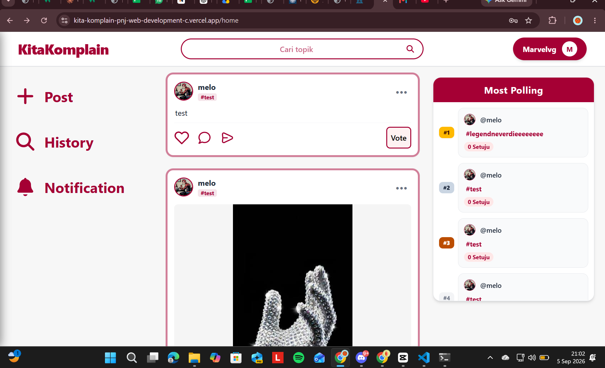

  <p><em>Homepage - Tampilan utama aplikasi</em></p>

<!-- History -->
  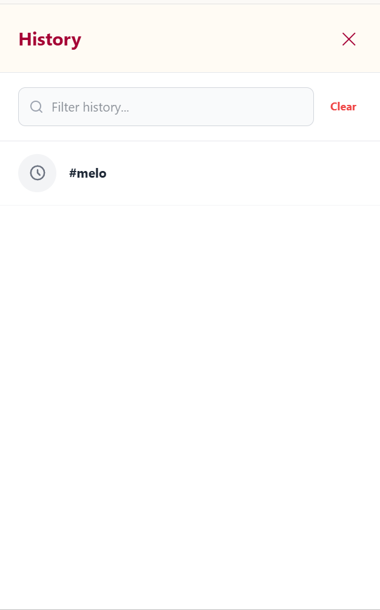

  <p><em>History - Riwayat aktivitas pengguna</em></p>

<!-- Notification -->
  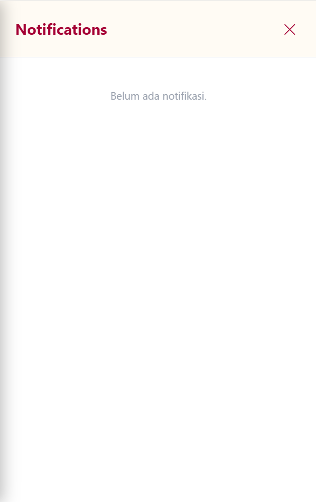

  <p><em>Notification - Daftar notifikasi pengguna</em></p>

<!-- New Post -->
  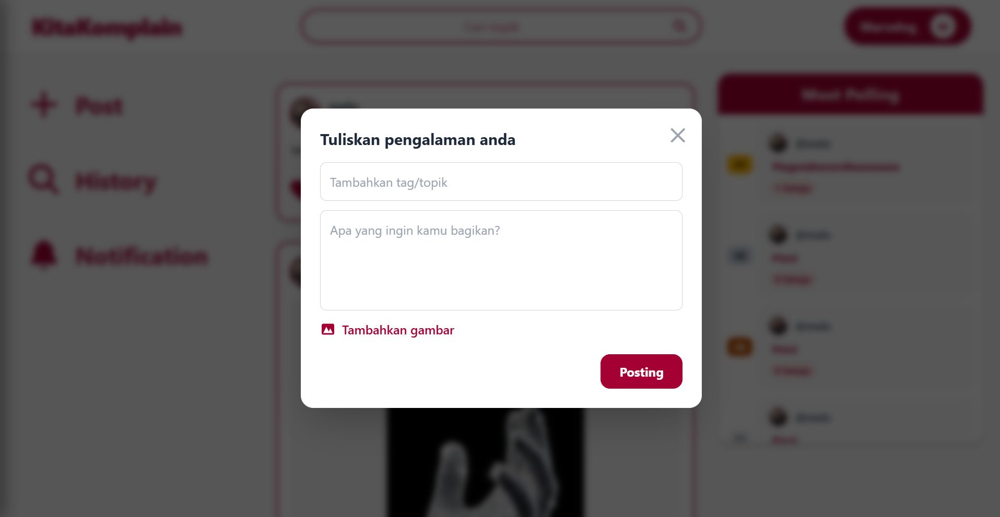

  <p><em>New Post - Membuat postingan baru</em></p>

<!-- Profile -->
  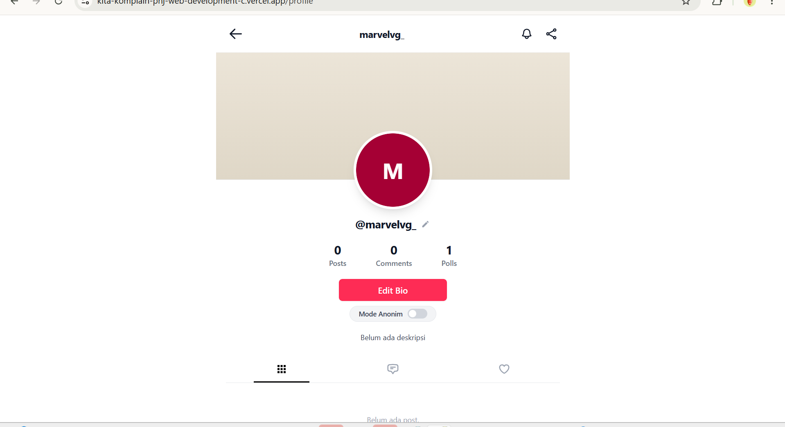

  <p><em>Profile - Halaman profil pengguna</em></p>

<!-- Setting -->
  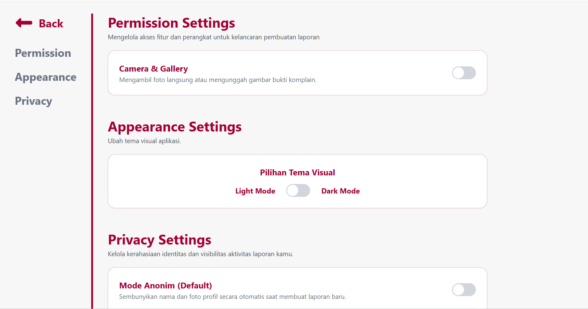

  <p><em>Setting - Pengaturan akun dan aplikasi</em></p>

<!-- Most Polling -->
  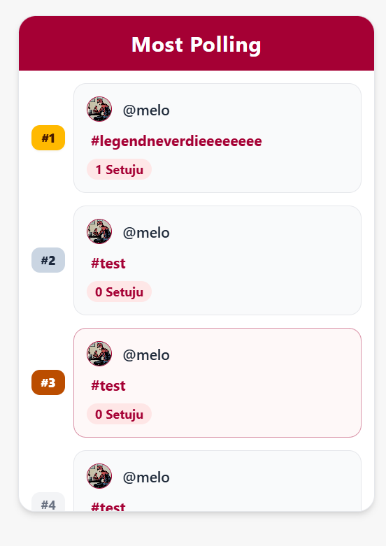

  <p><em>Most Polling - Daftar polling terpopuler</em></p>


<!-- Admin Panel -->
  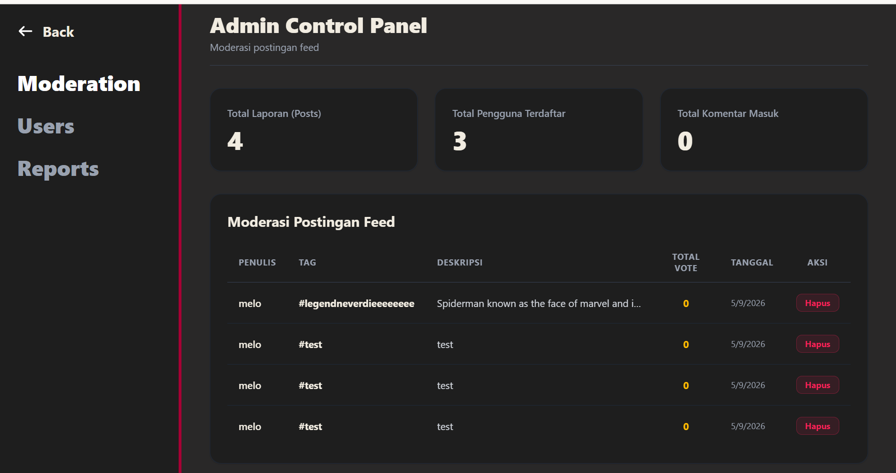

  <p><em>Dashboard Admin - Panel kontrol pengguna</em></p>

  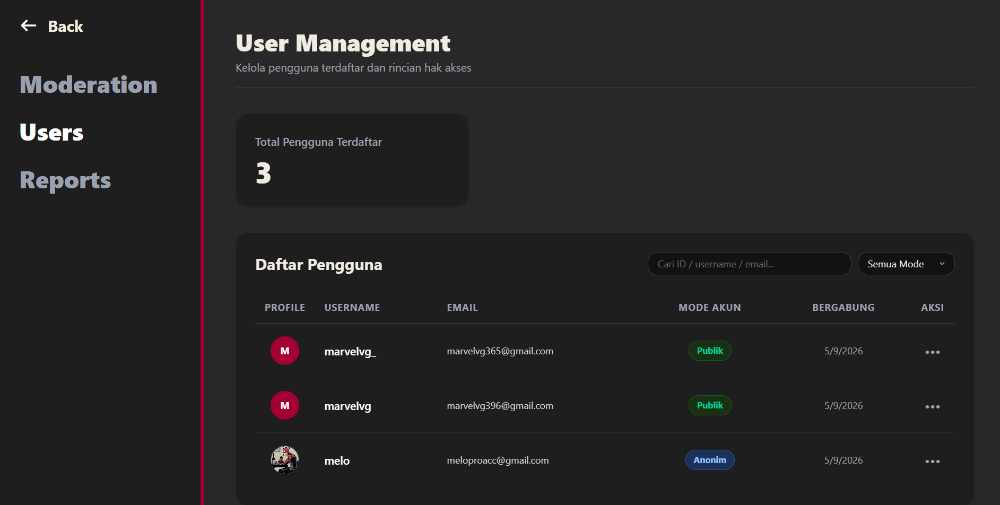

  <p><em>Dashboard Admin - Tampilan pengelolaan data</em></p>

  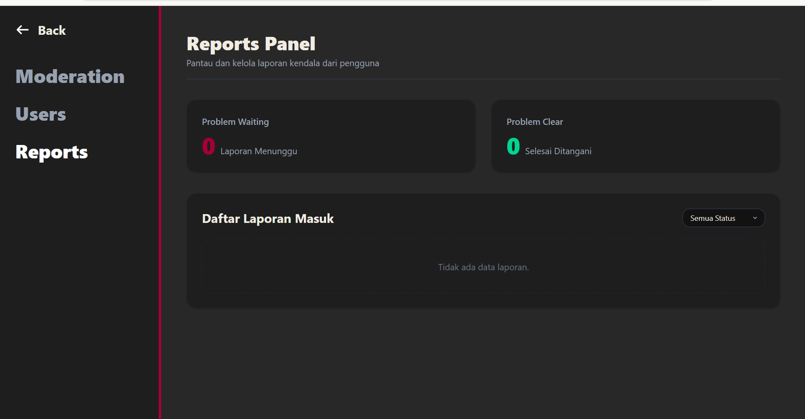

  <p><em>Dashboard Admin - Tampilan pengelolaan laporan</em></p>

<!-- Konfigurasi Dark Mode -->
<!-- DarkMode Setting Toggle -->
  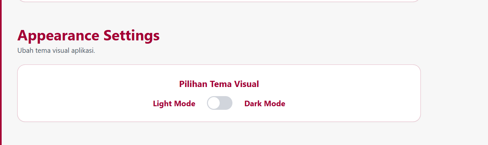

  <p><em>Dark Mode Setting - Toggle pengaturan mode gelap</em></p>

<!-- DARK Mode Home -->
  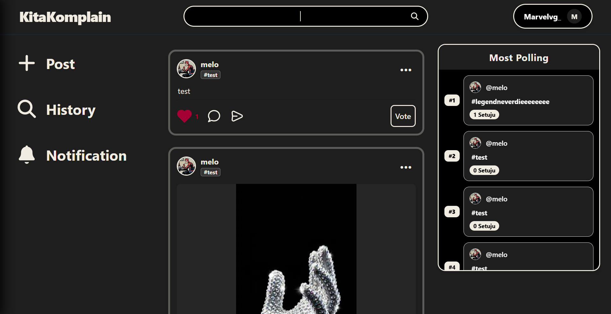

  <p><em>Dark Mode Home - Tampilan homepage dalam mode gelap</em></p>

<!-- DARK MODE PROFILE -->

  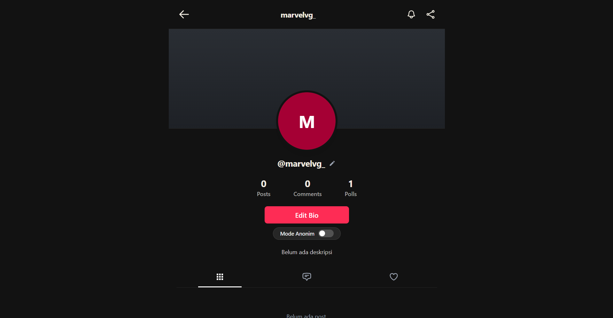

  <p><em>Dark Mode Profile - Tampilan profil dalam mode gelap</em></p>

<!-- Dark Mode New Post -->
  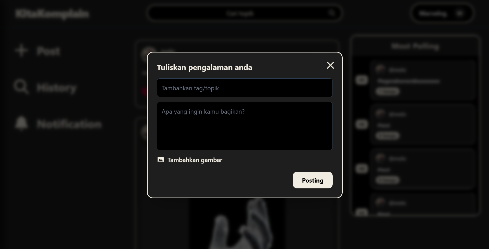

  <p><em>Dark Mode New Post - Form postingan dalam mode gelap</em></p>

<!-- Dark Mode Notification -->
  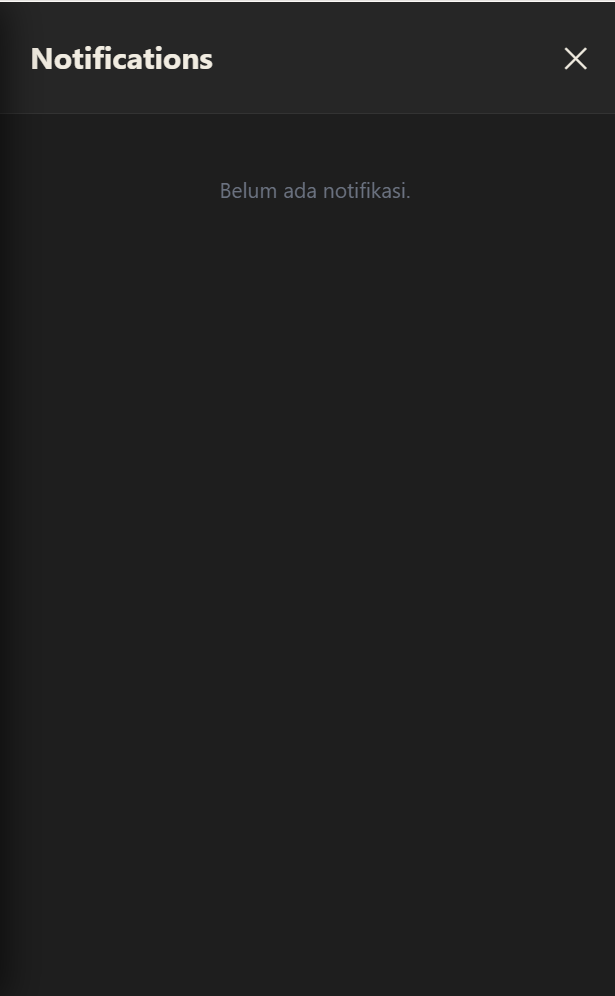

  <p><em>Dark Mode Notification - Notifikasi dalam mode gelap</em></p>

<!-- DARK MODE History-->
  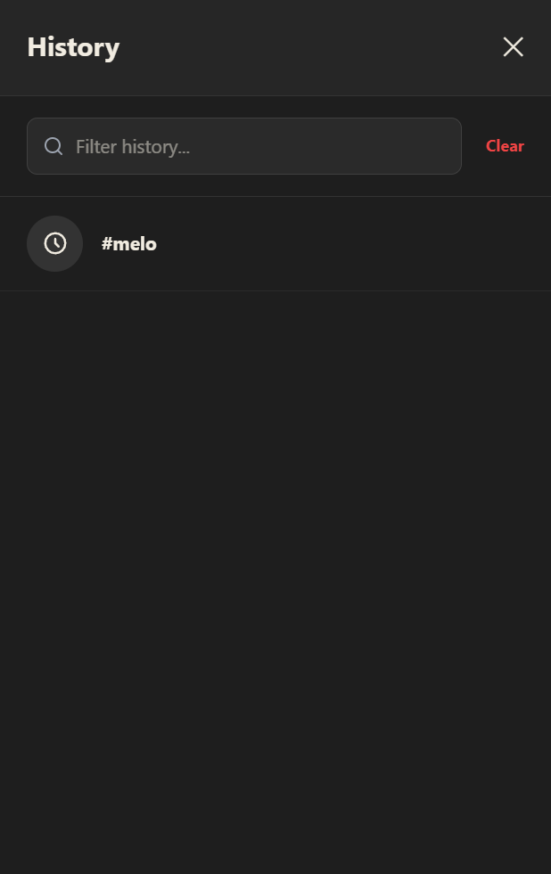

  <p><em>Dark Mode History - Riwayat aktivitas dalam mode gelap</em></p>

<!-- DARK MODE Report -->
  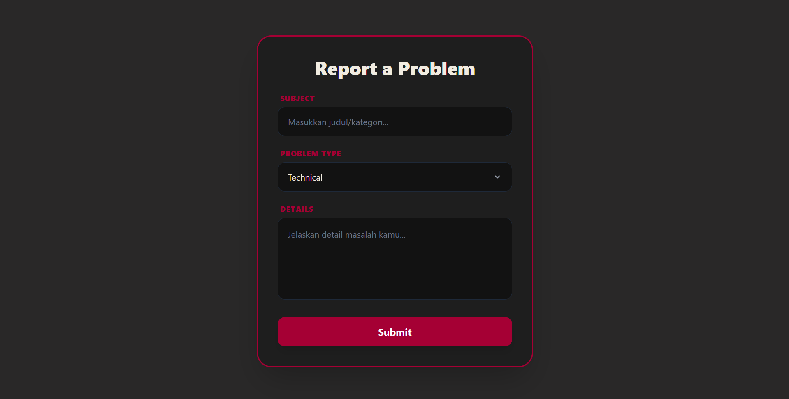

  <p><em>Dark Mode Report Problem - Laporan masalah dalam mode gelap</em></p>

<!-- Dark Mode Most Polling -->
  

  <p><em>Dark Mode Most Polling - Daftar polling terpopuler dalam mode gelap</em></p>

</div>

## 🛠️ Teknologi

### Tech Stack
#### Frontend

```

Framework    : React
UI Library   : Tailwind
State Mgmt   : Context API
Validation   : React Hook Form
```

#### Backend

```

Runtime      : Node.js
Framework    : Express
Database     : Supabase (PostgreSQL)
ORM          : Supabase Client / SQL
Auth         : JWT

```

#### DevOps & Tools

```

Deployment   : Vercel
CI/CD        : Vercel 
Testing      : Vitest
```

### Alasan Pemilihan Teknologi

| Teknologi | Alasan Pemilihan |
|-----------|------------------|
| **React** | React dipilih karena struktur komponennya yang reusable dan mudah di gunakan. Hal ini memudahkan pengembangan fitur seperti pemanggilan modal yang berulang, penggunaan useState, API dan struktur yang kompleks | 
| **Tailwind CSS** | Tailwind CSS di pilih karena mempercepat proses development UI baik pengembangan maupun update UI baru |
| **Express + Supabase** | Express digunakan sebagai backend API yang ringan dan flexible untuk menangani autentikasi, data komplain, serta integrasi fitur aplikasi. Supabase dipilih karena menyediakan database PostgreSQL, autentikasi, dan API realtime yang memudahkan pengelolaan data yang cepat dan aman. |

### Dependencies Utama 

```json

{

  "dependencies": {
    "@supabase/supabase-js": "^2.112.3",
    "express": "^5.2.1",
    "react": "^19.2.8",
    "react-dom": "^19.2.8",
    "react-router-dom": "^7.18.2"
    }
}
```

---

## 🏗️ Arsitektur Sistem
### System Architecture


### Database Schema


### Folder Structure
```

KitaKomplain-PNJ-Web-Development-Competition-
├── backend/
│   └── server.js
├── data/
│   └── Dummy_data.json
├── public/
│   └── assets/
├── src/
│   ├── assets/
│   ├── components/
│   │   ├── Anonim_mode.jsx
│   │   ├── Comment.jsx
│   │   ├── Comment_detail.jsx
│   │   ├── ConfirmContext.jsx
│   │   ├── ConfirmModal.jsx
│   │   ├── edit_post.jsx
│   │   ├── FocusPost.jsx
│   │   ├── History.css
│   │   ├── History.jsx
│   │   ├── Most_Polling.jsx
│   │   ├── Navbar.jsx
│   │   ├── Navbar_Admin.jsx
│   │   ├── newpost.jsx
│   │   ├── Notification.css
│   │   ├── Notification.jsx
│   │   ├── Post.jsx
│   │   ├── Protected_Route.jsx
│   │   ├── public_profile.jsx
│   │   ├── Report_Panel.jsx
│   │   ├── Share_post.jsx
│   │   ├── Sidebar_Kiri.jsx
│   │   ├── Status.jsx
│   │   ├── StatusContext.jsx
│   │   ├── Verify.jsx
│   │   └── Vote.jsx
│   ├── pages/
│   │   ├── Admin_Dashboard.jsx
│   │   ├── Home.jsx
│   │   ├── Login.jsx
│   │   ├── Login.css
│   │   ├── Profile.jsx
│   │   ├── ReportProblem.jsx
│   │   ├── ReportProblem.css
│   │   ├── Search_page.jsx
│   │   ├── Settings.jsx
│   │   ├── SignUp.jsx
│   │   └── SignUp.css
│   ├── temp_files/
│   │   └── Other_profile.jsx
│   ├── App.css
│   ├── App.jsx
│   ├── index.css
│   ├── main.jsx
│   └── supabaseClient.js
├── .gitignore
├── eslint.config.js 
├── index.html
├── package-lock.json
├── package.json
├── README.md
├── tailwind.config.js
├── vite.config.js
└── node_modules/

```

---

## ⚙️ Instalasi & Setup
### Prerequisites

Pastikan Anda telah menginstall:
- **Node.js** (v18.x atau lebih tinggi)
- **npm** 
- **Git**

### Langkah Instalasi

#### 1️⃣ Clone Repository

```bash

git clone https://github.com/Carmeloanthony1/KitaKomplain-PNJ-Web-Development-Competition-.git

cd [KitaKomplain-PNJ-Web-Development-Competition-]

```

#### 2️⃣ Install Dependencies

```bash

# Menggunakan npm
npm install
# Atau menggunakan yarn
yarn install
# Atau menggunakan pnpm
pnpm install

```

#### 3️⃣ Setup Environment Variables

Buat file `.env` di root directory lalu masuk ke folder backend:

``` env.example

PORT=
SUPABASE_URL=
SUPABASE_ANON_KEY=
JWT_SECRET=

```

#### 4️⃣ Setup Database

Project ini menggunakan Supabase sebagai database utama. Silakan buat project baru di Supabase, lalu buat tabel dan data awal lewat SQL Editor / Dashboard.

```sql
-- Contoh membuat tabel sederhana
CREATE TABLE IF NOT EXISTS profiles (
  id UUID PRIMARY KEY DEFAULT gen_random_uuid(),
  username TEXT,
  bio TEXT,
  created_at TIMESTAMPTZ DEFAULT NOW()
);
```

Setelah itu, isi nilai `SUPABASE_URL` dan `SUPABASE_ANON_KEY` pada file `.env`.

#### 5️⃣ Run Development Server

```bash
npm run dev 
``` 

Aplikasi akan berjalan di `http://localhost:3000`

---

## 🚀 Penggunaan
### Menjalankan Aplikasi

```bash

# Development mode
npm run dev

# Production build
npm run build
npm run start

# Run tests
npm run test

# Linting
npm run lint

```

### User Guide

#### Untuk Pengguna Umum

1. **[Registrasi/Login]**: [ Sebelum memulai website setiap user wajib login akun terlebih dahulu, untuk berkomunikasi baik sebagai anonim/bukan anonim ]

2. **[Membuat Komplain]**:  [ Pengguna dapat menulis postingan terkait masalah infrastruktur, fasilitas umum, atau lingkungan yang ingin dilaporkan dengan menambahkan detail, lokasi, dan deskripsi yang jelas. ]

3. **[Memberi Dukungan / Vote]**: [ Pengguna dapat memberikan dukungan pada komplain yang dianggap penting agar isu tersebut lebih terlihat dan berpotensi mendapatkan perhatian lebih luas dari masyarakat maupun pihak terkait. ] 

#### Untuk Admin

1. **Akses Admin Panel**: Admin diberikan hak akses melalui Supabase (role/permission di-set di sana). Untuk masuk ke panel admin, tinggal ganti routes menjadi `/admin` dari root domain.
   
   Contoh: `[namaDomain]/home` → `[namaDomain]/admin`

2. **Delete Account**: Admin dapat menghapus akun user yang dianggap melanggar ketentuan atau atas dasar laporan yang masuk. Aksi ini bersifat permanen dan akan menghapus seluruh data terkait akun tersebut.

3. **Delete Post**: Admin dapat menghapus post/postingan user secara langsung dari admin panel, misalnya jika konten melanggar aturan komunitas.

4. **Baca Laporan User**: Admin juga dapat melihat dan meninjau laporan yang dikirimkan oleh user untuk menentukan tindakan lebih lanjut (delete post/account, dsb).

---

## 📚 API Documentation
### Base URL

```

Development: http://localhost:3000/api
Production:  https://[domain]/api

```

### Endpoints

#### Authentication

```http

POST /api/auth/register
POST /api/auth/login
POST /api/auth/logout
GET  /api/auth/me

```

#### [Resource 1]

```http

GET    /api/[resource]       # Get all
GET    /api/[resource]/:id   # Get by ID
POST   /api/[resource]       # Create
PUT    /api/[resource]/:id   # Update 
DELETE /api/[resource]/:id   # Delete 

```

### Example Request

```javascript

// Login

const response = await fetch('/api/auth/login', {

  method: 'POST',

  headers: { 'Content-Type': 'application/json' },

  body: JSON.stringify({

    email: 'user@example.com',

    password: 'password123'

  })

});

``` 

---

## 🧪 Testing 

### Running Tests

```bash

# Unit tests

npm run test

# Integration tests

npm run test:integration

# E2E tests

npm run test:e2e

# Test coverage

npm run test:coverage

```

---

## 📄 Lisensi

Proyek ini dilisensikan di bawah [MIT License](LICENSE) - lihat file LICENSE untuk detail lebih lanjut.

---

<div align="center">

  **Made with ❤️ by [KitaKomplain] for ITECHNO CUP 2026**

 

</div>
